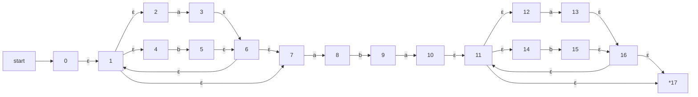
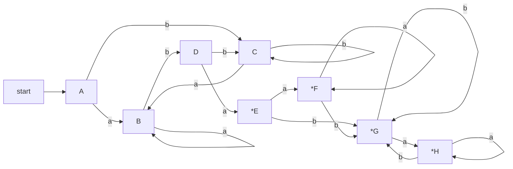
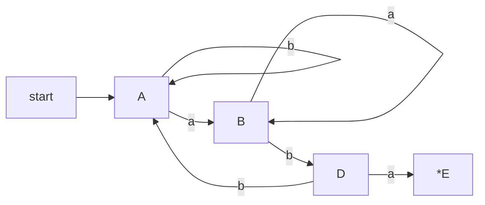

complier homework3 (RE-NFA-DFA-minDFA)
---
17341146 王程钥

**RE**

>(a|b)\*aba(a|b)\*

**NFA**

**DFA**

| NFA states | DFA state | a | b |
| - | - | - | - |
| {0,1,2,4,7}| A | B | C |
| {1,2,3,4,6,7,8} | B | B | D |
| {1,2,4,5,6,7} | C | B | C |
| {1,2,4,5,6,7,9} | D | E | C |
| {1,2,3,4,6,7,8,10,11,12,14,17} | E | F | G |
| {1,2,3,4,6,7,8,11,12,13,14,16,17} | F | F | G |
| {1,2,4,5,6,7,9,11,12,14,15,16,17} | G | H | G |
| {1,2,3,4,6,7,8,10,11,12,13,14,16,17} | H | H | G |

**Hint:** *E means E is a terminal node, so are other nodes.

**min-DFA**

Initially, since EFGH are terminal nodes, we set ABCD in group 1, and EFGH in group 2.
For all node pairs in group A, only for node A and C, terminal nodes are in the same group, so we can merge A and C together.
For all node pairs in group B, their terminal points are in the same group, so we can merge all of them together.
Here is the min-DFA.

