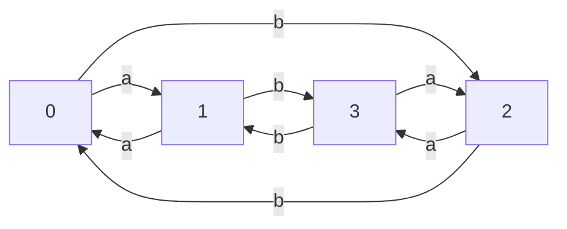

Complier Homework 4
---
17341146 王程钥

**Problem**
Write down Regular Expression, Regular Grammar and DFA for L.
L is a string consist of even number of letter a and letter b.

**Regular Expression**

> ( (aa|bb) | (ab|ba)(aa|bb)\*(ab|ba) )*

**Regular Grammar**

> S -->  CS
> S --> ε
> A --> aa | bb
> B --> ab | ba
> C --> A | D
> D --> BEBD
> D --> ε
> E --> A
> E --> ε
>

**DFA**

