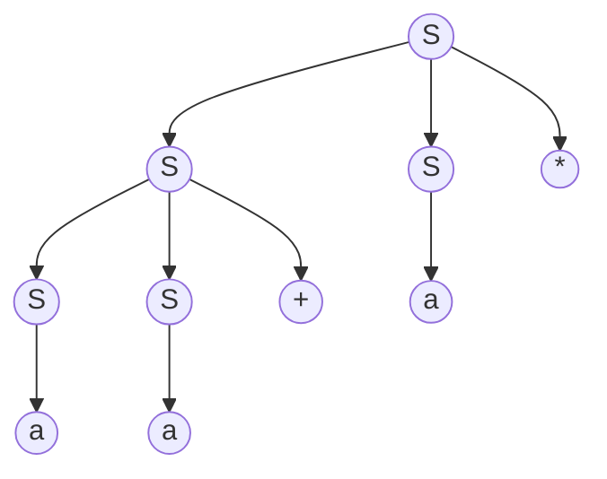

# Complier Homework 5

17341146 王程钥

### exercise  4.2.1

#### Problem

Consider th context-free grammar: $$S \rightarrow SS+|SS*|a $$ and the string $$aa+a*$$

- b) Give a right most derivation for the string.
- c) Give a parse tree for the string.
- d) Is the grammar ambiguous or unambiguous? Justify your answer.

#### Answer

- **b) most derivation **
$$S \Rightarrow SS* \Rightarrow Sa* \Rightarrow SS+a* \Rightarrow Sa+a* \Rightarrow aa+a*$$
- **c) parse tree**

- **d)** This grammar is unambiguous. Because excapt $S \rightarrow a$, only two grammar shoule be use on the sparse tree, $S \rightarrow SS+$ once, and $S \rightarrow SS*$ once. Since * is the right most character,  $S \rightarrow SS*$ should be use first, it should be on higher layer of the tree. So we can only construct one kind of sparse tree, and this grammar is unambiguous.

### exercise  4.4.1

#### Problem

For the following grammars, devise predictive parsers and show the parsing tables. (You may use left-factor and/or eliminate left-recursion from your grammars first).
- b) grammars : $S \rightarrow +SS|*SS|a$
- c) grammars : $S \rightarrow S(S)S|ε$
- d) grammars : $S \rightarrow S+S|SS|(S)|S*|a$

#### Answer

- **b)**

no left-factor
no left-recursion.
**parsing tables**
| non-terminal    | +    | *    | a    | $ |
| ---- | ---- | ---- | ---- | --- |
| S | $S \rightarrow +SS$ | $S \rightarrow +SS$ | $S \rightarrow +SS$ |  |

- **c)**

no left-factor
**eliminate left-recursion**
> $S \rightarrow A|ε$
> $A \rightarrow (S)SA$
**parsing tables**
| non-terminal    | (    | )    | $ |
| ---- | ---- | ---- | ---- |
| S | $S \rightarrow A$ |   | $S \rightarrow A$ |
| A | $A \rightarrow (S)SA$ |   | $A \rightarrow ε$  |

- **d)**
**eliminate left-factor**
> $S \rightarrow SA|(S)|a$
> $A \rightarrow +S|S|*$

**eliminate left-recursion**

> $S \rightarrow (S)S'|aS'$
> $A \rightarrow +S|S|*$
> $S' \rightarrow AS|ε$

**parsing tables**

| non-terminal | ( | ) | a | * | + | $ |
| ---- | ---- | ---- | ---- | ---- | ---- | ---- |
| S | $S \rightarrow (S)S'$ |   | $S \rightarrow aS'$ |   |   |   |
| A | $A \rightarrow S$ |   | $A \rightarrow S$ | $A \rightarrow *$ | $A \rightarrow +S$ |   |
| S' | $S' \rightarrow AS$ |   | $S' \rightarrow AS$ | $S' \rightarrow AS$ | $S' \rightarrow AS$ | $S' \rightarrow$ε |