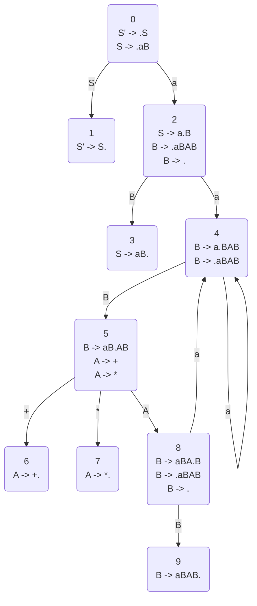

# Complier Homework 6

17341146 王程钥

### Exercise  4.6.2

#### Problem

1. Construct the SLR set of items for grammar S.
2. Compute the GOTO function for these sets of items.
3. Show the parsing table for this grammar.
4. Is the grammar SLR?
$$
S \rightarrow SS+|SS*|a \tag {1}
$$
#### Answer

**eliminate left-fector and left-recursion**
> $S' \rightarrow S$
> $S \rightarrow aB$
> $A \rightarrow +|*$
> $B \rightarrow aBAB|ε$

**LR(0) Automaton**

**SLR set** and **GOTO function** are showed in the graph above.

**parsing table**
| Status | Action | Action | Action | Action | GOTO | GOTO | GOTO |
|---|---|---|---|---|---|---|---|
|   | a | + | * | $ | S | A | B |
| 0 | s2 |   |   |   | s1 |   |   |
| 1 |   |   |   | acc |   |   |   |
| 2 | s4 | r3 | r3 | r3 |   |   | s3 |
| 3 |   |   |   | r1 |   |   |   |
| 4 | s4 | r3 | r3 | r3 |   |   | s5 |
| 5 |   | s6 | s7 |   |   | s8 |   |
| 6 | r4 |   |   | r4 |   |   |   |
| 7 | r5 |   |   | r5 |   |   |   |
| 8 | s4 | r3 | r3 | r3 |   |   | s9 |
| 9 |   | r2 | r2 | r2 |   |   |   |

Since there doesn't exist conflict, it's a SLR grammar.

### Exercise  4.6.3

#### Problem
Show the actions of your parsing table for Exercise 4.6.2 on the input aa*a+.

#### Answer

| num | Stack | Symbols | Input | Action |
|---|---|---|---|---|
| 1 | 0 |   | aa*a+$ | move |
| 2 | 02 | a | a*a+$ | move |
| 3 | 024 | aa | *a+$ | reduce by B->ε |
| 4 | 0245 | aaB | *a+$ | move |
| 5 | 02457 | aaB* | a+$ | reduce by A->* |
| 6 | 02458 | aaBA | a+$ | move |
| 7 | 024584 | aaBAa | +$ | reduce by B->ε |
| 8 | 0245845 | aaBAaB | +$ | move |
| 9 | 02458456 | aaBAaB+ | $ | reduce by A->* |
| 10 | 02458458 | aaBAaBA | $ | reduce by B->ε |
| 11 | 024584589 | aaBAaBAB | $ | reduce by B->aBAB |
| 12 | 024589 | aaBAB | $ | reduce by B->aBAB |
| 13 | 023 | aB | $ | reduce by S->aB |
| 13 | 01 | S | $ | acc |